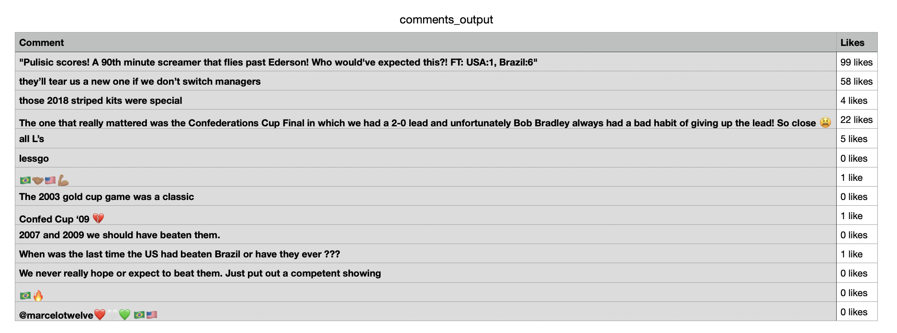

## Usage

`python3 parse_comments.py <file_location>`

`file_location` should be the location of an HTML file that contains an Instagram post with loaded comments. If the comments are not loaded before saving the HTML page, then it will not be included in the output.

I was not able to automate the download process since I assume Instagram's robot.txt did not allow it.

## Output

